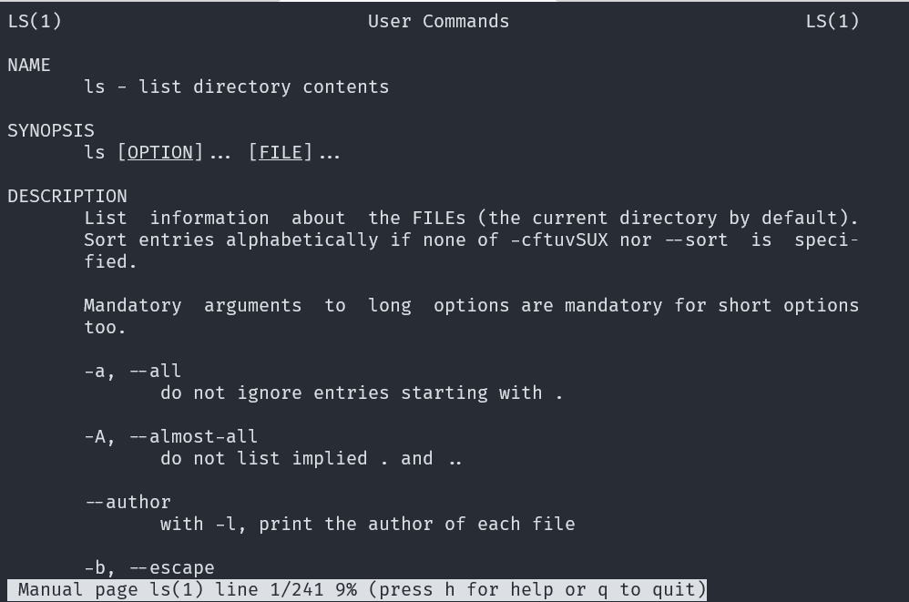
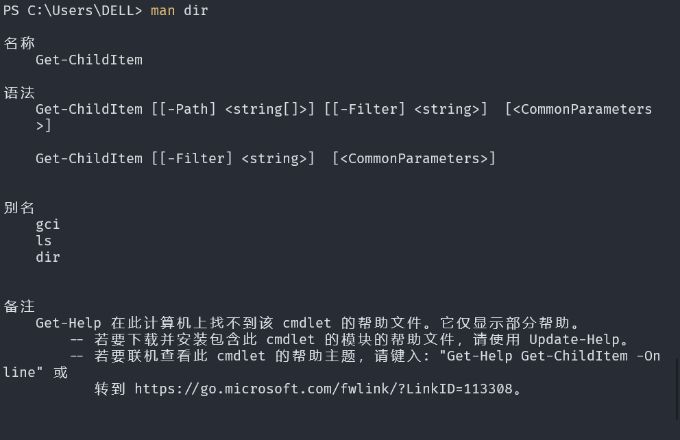

# 入门指南

# 前言

这是一份给“小镇做题家”的CS入门指南。

这是我从"小镇做题家"到变成CS专业大学生的经验，也是对我本科三年的一个总结，希望能为那些还未进入CS大门的"做题家"路牌。

目前规划了以下部分：

* 从CS入门到放弃：从高中到大学的转变
* CS中的宝刀：必学工具
* 其他推荐

## 启蒙

大一刚入学时，我还是个对编程一窍不通的小白。军训的时候，按着从二手书店买了的《c语言从入门到精通》在自己电脑上折腾上古时代的宝贝：VC 6.0 ，对着谭浩强的c程序设计敲着Hello World，每天和OJ上的字符串操作和数列求值打的难舍难分。本来觉得靠着竞赛和高中数学的底子，在大学可以成为一个不错的大学生，但是这一次的浅尝辄止的自学c语言经历给了我当头一棒。等到开课后，用着老师提供的code::blocks，抄着不知所云的程序，仰望着OI爷们和老师争辩。提到编程，脑子里只有打开一堆英文软件，新建一个文件，运行一个从来没见过的黑窗程序。整个课程都在和OJ斗争，到最后只能把流传以久的学长代码CV上去，最后的程序设计大作业，也是从网上东抄抄西凑凑才搞定的。可以说，半个学期的的程设课，磨灭了我对计算机的任何想法，听着周围同学讨论着链表，DFS那些我从未听过的名词，大作业用着Qt，OpenGL以及MFC这些完全没接触过的技术，甚至有想过转专业。后来开设的计算机系统基础，也给了我的信心沉重的打击，时至今日，对于系统基础第一次课ppt所提出的问题，我还是没有完全搞懂，混着混着一学期就过去了。临近考试，转机似乎来了，抱着临阵磨枪的心态点看了袁春凤老师的慕课，听着听着好像自己对寄存器、堆栈有了点感觉，这也是我第一次体验自学，自此似乎打开了一扇大门。

## 摆脱

有了大一第一学期的经验后，似乎摆在自己面前的路又多了一条：自己动手。彼时，我还处在高考的思想"荼毒"下，脑子里只有分数，坚信着只要理论搞懂，考试考个不错的分数就挺好的。的确，对于高考，这样的想法没什么问题，但是对于大学，这种思想真的会害你还得很惨，缺少实践的学习如同无本之木，尤其对于像计算机这样的工科来说。从数据结构这门课开始，我似乎对这种"高考化"的想法有了些抗拒，明明理论课上链表、栈、二叉树这些数据结构一看就懂，为什么实验课会举步维艰呢？当我面对着一个高精度求圆周率值敲了一天还没Accept时，我才真正的认识到代码能力对CSer的重要。当你肯花一整天把某个数据结构手撸一遍时，当你肯一边一边的调试着原因不明的段错误时，当你愿意把自己的想法用代码实现时，才算真正的步入了CS的大门。很重要的一点，去高考化！高中和大学是不同的两个阶段，也许你可以带着高中的思想完成大学的学业，甚至拿到推免资格，但当你步入社会，谁会看得起一个只能考高分的"卷王"呢？不可否认，当今大学的去高考化做的真的不好，甚至说高考化成为一个风向。大家带着高中时被过度强化的训练和扭曲的价值观(部分)来到大学，而大学提供着陈腐乏味的教程(百年不变的培养方案)和稳固的舒适区(祖传的大作业和往年考题)，更可怕的是。而**当你想要实现自己的远大抱负，去改变这个世界时，你要拿去什么改变**是考试周前做两套往年题还是大作业照搬学长的代码？我想，如果真的想改变世界，不妨从现在开始先摆脱高考化的思想，做大学高考化潮流下的中流砥柱吧。（借用南大JYY老师的一页ppt,[bilibili](https://space.bilibili.com/202224425),强烈推荐jyy的操作系统课程）请务必牢记：**大学四年留给你的是你的人生，在你毕业之时，那一串苍白的分数其实就已经作废了。**


## 真正的开始

经历了大一的阵痛和迷茫后，我似乎更能理解这个专业了，大类分流靠着大一不算摆烂的GPA压线进了CS专业。虽然是专业吊车尾，但我似乎对自己的期望不再完全是成绩了，**比成绩重要的东西可太多了**，我希望自己能真正的把自己学到的东西用起来，或者是希望能学到真正有用的东西。靠着兴趣，暑假自学了python和C++的面向对象，期望着能靠着这些做出一些东西来。巧合的是，开学两周的信息技术实践课实践的就是爬虫，靠着两个月的自学很轻松的完成了项目(甚至还帮几个同学写了大作业)，我才第一次认识到原来靠自学就可以完成"这么大"的项目，也开始摒弃被动接受的思维，转为主动寻找。就这样，抱着玩一玩加上培养下自己的能力的心态，我加入了软件基地和智能车基地，可以说大学里对我影响最大就是加入基地：见识到了很多大佬学长，通过在基地的实践掌握了如何快速学习一个新东西的能力，也真真实实的把自己的能力用到了项目上。从第一次看自己智能车动起来到校赛前折戟，再到被WYL学长拉去队友，再到住在基地调PID和陀螺仪滤波，再到去重大参加西部赛。这一路走来，感觉自己真的成长了不少，对自己的去高考化也越来越彻底，暑期报名了ASLP的实习，和队友一起体验了"科研"的感觉，面对曾经望而却步的试点班也可以鼓起勇气去参加... 从某种意义上来说，我的大学是从大二开始的，从那时开始，我一直在告诉自己，**就算你把课本上的内容搞得再烂熟，绝不代表你真正对这门课能有什么理解，相反，那些真正理解的人，却不一定能针对考点答出高分**，不要为了那些微不足道的分数而放弃自己的未来(这也不是大家摆烂的借口)。

## To Be Continued

"往者不可谏，来者犹可追。"我们当中太多人已经习惯于沿着那一成不变的“典型成功道路”前进，彷佛所有人的终点都是一样，前往终点的道路也只有一条。我们走上了某条道路便只顾着赶路，甚至都没有空停下来看看是否终点不只有一个，道路不仅有一条。我们只看到有人走了捷径，却没有发现正是这些人中间停下了脚步，花了更多的时间来选目标和选路，然后更快地完成罢了。他们的方式更有效率。一位伟人说过：“**一个人的命运，既要考虑个人的奋斗，也要考虑历史的进程。**”只顾个人奋斗却不顾历史进程也会使你在错误的道路上朝着错误的目标越走越近。在前行的道路上，我们随时都可以停下思考和观察，修正自己的目标或是看看有没有新出现的路。有时候你看不到路，不是因为路不存在，只是你不知道。回首三年大学时光，我一直保有一种强烈的对知识和技术的虔诚。这份虔诚迫使我重新思考每天那本应"司空见惯"的生活；也是这份虔诚让我以我认为正确的方式贯彻自己的追求。在大三升大四的这个暑期，在公司实习的时候，回想自己三年的大学经历，略有不舍，便想着将他记录下来(也是为了工作摸鱼)。一方面，我希望我能为那些像我一样压抑中的灵魂尽一点义务。另一方面，也希望这能成为推动各种不合理制度进步的一种动力。**我们每个人心中总要有些英雄主义**，**不是吗？**

# 从入门到放弃

## 放弃高考思维

我们的体制总倾向于用一个量化的分数来概括衡量一个人。这一体制在高考中登峰造极。在大学里，我们也会面临无数定量的评分机制：从各科考试、综合测评、到毕业出国、读研、工作. . . 都少不了和分数打交道。面对这些分数，我们必须保持头脑清醒：**如果一个人把政策评分作为自己的至高追求，那么他就是这个政策的牺牲品。** 但是你要知道，分数并不能说明什么，它完全不能说明你对于这门课内容的掌握情况，这是因为信息不对称导致，你所掌握的能力是为了在考试中获得更高的成绩而不是掌握这门课内容本身，相反，许多在这门课上造诣很深的人反而拿不到很高的分数。你需要时刻牢记，你的分数在你毕业之后都已作废，分数的确是通往更高平台的通行证，但是**与你本身的能力却是无关的** 。

## 放弃被动思维

进入大学后，没有人会再为我们自己的行为负责，所以不管做什么都要想清楚自己为什么而作。每天迫于各种压力，毫无主见地忙碌着，可称得上人生一大悲哀。但是很多时候我们并不能，我们无法回答出自己为什么每天都要去上课，如果去上课仅仅是为了回答老师的点名的话，正如我之前所说，分数的意义在毕业后就不复存在，那么，如果存在一些可以不去上课而获得一个相对满意的分数，如果不去上课可以做一些更有意义的事情，如果我们所感兴趣的知识并没有课程能够涉猎，这时候我们还需要去上课吗？**正确的浪费剩余的时间！**

## 放弃"连续"的思维

扯了这长篇幅废话，终于要来点"学术"上的东西了。 思考一个问题，已知

$$
a_n=2a_{n-1}, a_0 = 1,
$$

求$a_5$的值，很简单吧，看一眼就能得出答案，但如果假设你是一个计算机，你该怎样计算呢？计算机可没办法一眼看出通项公式是

$$
a_n = 2^n
$$

，他能做的就是一次次迭代(不考虑优化)：

```
a_pre,a_next = 1,0
for i=0:5
   a_next = a_pre*2
   a_pre = a_next

```

计算机并不是连续的，而我们高中时的思维是连续，这也是很多人最开始程设觉得难的原因。往深的说，程序乃至整个计算机系统都是一个[状态机模型](https://zhuanlan.zhihu.com/p/47434856)，对于程序设计语言来说，变量(对象)的值是状态，而当中的控制流就是描述状态如何转移，对于计算机系统来说，状态便是寄存器和内存，汇编指令则是在描述状态的转移。值得一提的是，在某种程度上，这两个状态机是等价的，甚至存在转换工具(编译器)。如果从开始接触CS是就有了状态机的概念，并在以后的学习不断强化理解他，这样你就嫩很快理解CS这门学科(大部分的东西都与状态机有关)。

# 必学工具

## 写在前面的话

### 远离CSDN和百度

如果你不想在一堆相互抄来抄去的文章和广告里寻找自己想要的东西，就去试试bing和Google。一个很形象的比喻，在CSDN和百度上找东西就像是在垃圾堆里面找宝贝。已我最近工作时查找的问题为例：


百度的给我提供的东西只能说是毫无关系，而谷歌第一个就是相关的问题，如果你打开第一个StackOverflow的链接，你可以发现回答者从Qt源码级指出了问题并提供了解决方案。也许一次这样的差距并不能决定什么，也许百度/CSDN会给你提供一个不知道为什么的解决方案... 但长久下去，别人每次都能从搜素中获取知识，而你每次只能复制一堆不知道是啥的命令去执行暂时的解决问题，差距不就有了吗？

### 避免中文关键词

可能大伙都很不喜欢那种说话夹带着英文的人，但没办法，在CS里，无论是起源还是发展似乎都是西方主导(希望以后你们能改变现状)，很多东西由于历史原因翻译出来很怪很不直观，比如说handle被翻译成了句柄(反正我第一眼看过去不知到是啥)，甚至于有些关键字有不同的翻译，所以为了避开这些问题，建议使用英文关键字，对自己以后的科研(如果想的话)也是大有裨益的。

### RTFM，STFW，RTFSC

某种意义上，这三个词是CS里面的圣经。

* RTFM ： Read The ~~Fucking~~ Friendly Manual 		去读手册
* STFW ： Search The ~~Fucking~~ Friendly Web		去网上搜
* RTFSC:    Read The ~~Fucking~~ Friendly Source Code	去读源码

想了解[更多](https://github.com/ryanhanwu/How-To-Ask-Questions-The-Smart-Way/blob/main/README-zh_CN.md#rtfm-%E5%92%8C-stfw%E5%A6%82%E4%BD%95%E7%9F%A5%E9%81%93%E4%BD%A0%E5%B7%B2%E5%AE%8C%E5%85%A8%E6%90%9E%E7%A0%B8%E4%BA%86)可以点进去看看。

### 如何面对问题

在大学里，除了老师/助教**没有人有义务去替你解决问题**。

 你可能会遇到很多问题, 比如:

* 不清楚某个工具的用法.
* 不清楚某个功能实现的思路.
* 编译/链接代码时出现警告或报错.
* 程序输出的结果和你的预期相去甚远.
* 其他各种各样的问题……

与其说, 遇到问题是一件很正常的事, 不如说, 没遇到问题才是一件不正常的事情.

面对问题时，不要:

* 抱着应付的态度, 遇到问题时随便改改自己的代码, 能过测试用例就万岁了.
* 发现随便改改也没用, 于是直接找大佬/助教/老师求助, 不加任何思考.
* 求助的时候问一些相当没价值的问题, 比如: “我的程序出错了, 怎么办”.

  * 想象一下你的电脑小白朋友, 三天两头来问你 “我电脑坏了, 怎么办?”, 同时完全不说到底发生甚摸事了, 你还能否保持低血压的健康生活.
* 在某些国内网站上一通乱搜, 找到了另一些国内网站上的低质量内容, 大抄特抄.

  * ~~然后丝毫没有意识到, 自己在几天后遇到的某个问题就是因为抄了垃圾代码而导致的~~

你应该:

* 不放过任何一个问题,  **包括编译代码时的警告** .
* 遇到问题时对背后的原因多加思考, 找出它的深层原因.
* 独立解决问题, ，同时 **不要怕尝试, 不要怕 debug** , 你会在这个过程中学到相当多的东西, **善于提出问题固然很棒，但更难能可贵的是自己解决**.
* 遇到自己解决不了的问题: **STFW，RTFM**, **RTFSC** 搜索引擎和文档/手册里通常能找到绝大部分问题的答案, 如果没有, 源码里一定会有.
* 学会摆脱对百度的依赖,  **在 Google/Bing 上用英文搜索问题** . 中文互联网什么样相信各位心中自有 B-tree
* 自己解决：对于一个大学生来说，善于提出问题是好事，但更难能可贵的是去自己解决。
* 去各种网址上提问：诸如Stackoverflow，知乎(也有很多大佬)都提供提问功能，甚至于去Github/Gitee上提一个Issue寻求原作者的帮助也是可以的。不过在提问是要注意提问的方法，当你拋出一个技术问题时，最终是否能得到有用的回答，往往取决于你所提问和追问的方式。很推荐读一读[提问的艺术](https://github.com/ryanhanwu/How-To-Ask-Questions-The-Smart-Way/blob/main/README-zh_CN.md)以及[别想弱智一样提问，](https://github.com/tangx/Stop-Ask-Questions-The-Stupid-Ways/blob/master/README.md)学会如何提问对提问者和被提问者都是件好事。

如果你在解决问题的过程中实在坚持不下去了, [听听尼尔叔叔的鼓励](https://www.bilibili.com/video/BV1Fi4y1t7uG)(手动狗头).

### The Missing Semester

考虑到大学中可能并不会专门讲授一些常识性的内容 (但显然**这不合理** )， 这些现象的出现也情有可原. 但在开始大学之前, 你必须对此有一个最基本的认识, 否则在你面前的, 将会是一条通往地狱的路。

我强烈推荐抽一些时间, 学习一下 MIT 的 [The Missing Semester of Your CS Education](https://missing.csail.mit.edu/)，这会对后来的学习有很大帮助。

## 翻墙

由于一些众所周知的原因，谷歌、GitHub 等网站在大陆无法访问。然而很多时候，谷歌和 StackOverflow 可以解决你在开发过程中遇到的 95% 的问题。因此，学会翻墙几乎是一个内地 CSer 的必备技能。因为这个话题比较敏感，有需求的话可以考虑某些开源项目

* [https://github.cm/freefq/free](https://github.com/freefq/free)
* [https://github.com/bannedbook/fanqiang](https://github.com/bannedbook/fanqiang)
* [https://github.com/Alvin9999/new-pac](https://github.com/Alvin9999/new-pac)

PS：打个小广告, 个人自用[VPN](https://sodacloud.pw/auth/register?code=FzGQ)，100/年，不限带宽，最多支持3设备。点此注册我会获得10%你充值的总额的收益。如果介意，可在注册时去掉邀请码。

**墙外的世界纷繁复杂，请一定时刻保持清醒的认知，取其精华，弃其糟粕！！！**

## Git

Git 是一款分布式的代码版本控制工具(VCS)，出自大神Linus之手，据说是因为嫌弃当时主流的版本控制工具太贵又太不好用了就花了十天自己写了一个版本控制工具。不过在介绍git之前，得先知道为什么要做版本控制：

- **版本存储（正确地）**：经常性地保存项目的改动是一个非常重要的习惯。但是如果没有版本控制系统这个操作将是非常困难的，并且非常容易出错的：

  - 你到底改动了什么？仅仅是针对一些特定文件的改动还是整个项目？首先你必须及时并小心地审查整个项目的每一个可能的改动细节，然后你需要付出大量且并不必要的时间来整理它。
  - 你如何命名这些版本？ 你也许会定义一个比较容易理解的通用命名规则（比如“xx-2022-08-06-v22”）。然而一旦涉及到一个多样性的改变，仅仅通过名字是很难追踪和判断这些改动的。与此同时你也会收获到一批看着心烦的前版本文件。
  - 你如何知道版本之间的改动？这也是最重要的问题，很少会有人把改动记录到诸如README这样的文件里（细琐重复的事情应该让程序来做，不是吗？）
- **协同开发：** 试想一下，如果没有版本控制系统，当你需要处理那些共享文件夹中的文件时，你必须告知所有开发者，你正在对哪些文件进行编辑；与此同时，其他人必须要避免与操作相同的文件。这是一个不现实和完全错误的流程。当你花了很长时间完成你的编辑后，可能这些文件早已经被团队里的其他开发成员修改或者删除了。
- **恢复之前的版本：** 要把一些文件恢复到上次改动之前的版本（甚至整个项目恢复到之前的版本）。这可能意味着你发现了一些严重的问题！如果你确定那些改动是错误的或者是没有必要的，那轻松的点几下你就可以简单地撤销它。在项目的每一个重要阶段，认识和正确地使用撤销这个功能会让你的工作变得非常轻松。

一些你需要知道的Git基本内容:

* **初始化 Git 仓库:** 在仓库目录中 `git init`.
* **忽略部分文件的更改:** 在对应目录中放置 `.gitignore` 文件, 并在该文件中添加需要忽略的文件的规则.
* **查看仓库状态:** `git status`.
* **暂存更改:** `git add 文件名`, 或 `git add -A` 暂存全部更改.
* **提交更改:** `git commit`, 此时会弹出默认编辑器并要求你输入提交信息. 也可以直接执行 `git commit -m "提交信息"`.
* **添加远程仓库:** `git remote add 名称 仓库URL`.
* **推送本地提交到远程:** `git push`.
* **查看所有提交记录:** `git log`, 你可以从中看到某个提交的哈希值.
* **把仓库复位到某个提交的状态:** `git reset 提交的哈希值`.
* **从当前提交新建分支并切换:** `git checkout -b 分支名`.
* **切换到分支:** `git checkout 分支名`.
* **删除分支:** `git branch -D 分支名`.

上面提到了 `.gitignore` 可以让 Git 忽略目录中某些文件, 且不让它们出现在 Git 仓库中. 这有什么用呢?

你在开发过程中难免会产生一些 **“只对你自己有用”** 且 **“不值得永久保留”** 的东西. 比如你在开发的过程中希望写几个简单的输入来测试你的程序, 或者验证你程序里的某处是否写对了, 于是你新建了个名字叫 `test.txt` 的文件, 里面写了一些测试的内容, 然后你在本地调试的时候会让你的程序读取这个文件.

`test.txt` 显然只是个用来存放写一些只对你自己有用的临时内容的文件, 你不希望让 Git 每次都记录这个文件的更改 (因为没意义), 所以你可以把它写进 `.gitignore` 中, 来让 Git 忽略它.

其他类似的情况还包括, 你使用 VS Code 或 IDEA 开发你的编译器, 这些代码编辑器/IDE 可能会在项目中生成一些配置文件 (`.vscode` 或 `.idea`), 这些文件通常也是不需要被 Git 记录的, 因为其中包含了你的一些个人配置.

推荐两个网站，强烈推荐第一个，真的很好玩：

* [Learn Git Branching](https://learngitbranching.js.org/).
* [Git 快速入门](https://nju-projectn.github.io/ics-pa-gitbook/ics2021/git.html).

## Linux

Linux指的是操作系统内核，基于这个内核开发的操作系统叫做Linux的发行版，比较有名的发行版包括：Ubuntu、RedHat、CentOS等，对于CSer来说，为什么Linux会比Windows更好一点：

* 一些开发只能基于Linux进行，比如ROS。
* 在Windows下安装一些包/环境需要下载安装包并手动配置环境变量，而在Linux上只需apt install xxx(不要花太多时间和精力在配环境上)。
* 有些Tool-kit在window下虽然显示安装完成了，但当你使用的时候就会报错，比如在windows下配置CUDA took-kit，安装完成后，使用nvcc -v是可以正常工作的，但当你真的用nvcc去编译CUDA文件时会报错，找不到cl.exe。
* 在Linux下你可以很轻松的通过man来RTFM，具体可以参考[man入门教程](https://nju-projectn.github.io/ics-pa-gitbook/ics2021/man.html)，而在windows虽然也支持man，但是手册的内容很干燥，请自行对比。
  

"那我可以从哪下载linux呢？"，最简单方式是通过VM，采用虚拟机来运行Linux，至于Vmware的安装及Ubuntu(或者其他的发行版)镜像的下载请自行STFW。虚拟机是最简单的解决方案，但如果你不玩某些游戏(具体我也不清楚，只知道他们和Hyper-V冲突)，我强烈推荐试试WSL 2以及WSLg，WSL指的是Windows Subsystem for Linux，通过WSL+vs code的方式可以很高效的完成Linux上的开发，这是[官方文档](https://docs.microsoft.com/zh-cn/windows/wsl/)以及[awesome-wsl](https://github.com/sirredbeard/Awesome-WSL)，有兴趣的可以体验体检 (强推)。还有一种方式是直接在物理机上安装Linux的发行版，缺点是很麻烦，需要自己制作系统引导盘，还会碰到一些莫名其妙的问题，但优点就是你可以使用最原生的Linux，同时也可以体验一次在物理机上安装系统的过程。虽然学习计算机专业不是为了修电脑装系统, 但如果你连系统都没装过, 也确实不太好意思跟亲戚说你是学计算机的. 现在机会来了, 如果你以前真的从来没有安装过操作系统, 我们强烈建议你装一下真机, 来了解一下安装操作系统都需要经历些什么.

入门Linux很重要的一件事就是习惯命令行(CUI)，命令行所有的黑客都使用的黑色窗口。它可能刚开始看上去有点吓人，但事实上它只是等待你的命令提示符。尽管很多事情完全可以通过图形化界面(GUI)点点鼠标来完成，但如果你接受了了命令行的操作方式，你会获得：

* ~~看起来很炫酷的交互方式（装X）~~
* 对系统更强的掌控力：应用程序通常无法满足 power user 的全部需求
* 生产系统的事实标准：Linux, macOS, Windows, ...运维基本都靠命令行工具
* 来自开源社区的礼物：非常丰富、可定制、看得见源码的软件栈
* 对计算机系统更深层次的了解：通过各类工具（strace、gdb等）了解软件是工作的，~~通过命令行和70年代的程序员交流~~

一些你需要知道的命令行基本内容:

* **运行当前目录下程序:** `./程序名`.  比如你通过gcc编译链接了一个a.out文件，就可以通过 ./a.out 来运行这个程序。
* **查看上一条命令的返回值:** `echo $?`. 比如你可以在 Shell 中执行 `命令; echo $?` 来运行一个命令, 同时输出它的返回值.
* **重定向输出:** 你希望把某命令输出到标准输出 (`stdout`) 的内容重定向到文件里, 可以执行 `命令 > 输出文件`. 例如: `ls > output.txt`.
* **重定向输入:** 你希望把某个文件的内容作为某个命令的输入内容 (`stdin`), 可以执行 `命令 < 输入文件`. 例如: `wc -l < input.txt`.
* **管道:** 你希望运行多个命令, 将前一个命令的标准输出作为后一个命令的标准输入, 可以执行 `命令1 | 命令2 | ... | 命令n`. 例如: `cat hello.txt | grep "hello" | wc -l`.

一些常用命令:

* `cd 目录`: 切换到目录.
* `pwd`: 输出当前目录.
* `ls`: 输出当前目录下所有的文件.
* `mkdir 目录`: 新建目录.
* `cp 源文件 目标`: 把源文件复制到目标.
* `mv 源文件 目标`: 把源文件移动到目标.
* `rm 文件`: 删除文件.
* `man 命令`: 显示命令的使用方法.

推荐

[Linux 入门教程](https://nju-projectn.github.io/ics-pa-gitbook/ics2021/linux.html)

[命令行的艺术](https://github.com/jlevy/the-art-of-command-line)

## Github: 拥抱开源

从功能上来说，GitHub 是一个在线代码托管平台。你可以将你的本地 Git 仓库托管到 GitHub 上，供多人同时开发浏览。但现如今 GitHub 的意义已远不止如此，它已经演变为一个非常活跃且资源极为丰富的开源交流社区。全世界的软件开发者在 GitHub 上分享各式各样种类繁多的开源软件。大到工业级的深度学习框架 PyTorch, TensorFlow，小到几十行的实用脚本，既有硬核的知识分享，也有保姆级的教程指导，甚至很多技术书籍也在 GitHub上开源，所以闲来无事去逛逛 GitHub吧, 用好 [Github 的 “Awesome” 系列](https://github.com/search?q=awesome)。

如果你还从未在 GitHub 上建立过自己的远程仓库，也没有克隆过别人的代码，那么我建议你从 [GitHub的官方教程](https://docs.github.com/cn/get-started)和这份[CheetSheet](https://github.com/tiimgreen/github-cheat-sheet)开始自己的开源之旅。

GitHub 之所以成功，我想是得益于“我为人人，人人为我”的开源精神，得益于知识分享的快乐。如果你也想成为下一个万人敬仰的开源大佬，或者下一个 star 破万的项目作者。那就把你在开发过程中灵感一现的 idea 化作代码，展示在 GitHub 上吧～[How to contribute to opensource](https://github.com/freeCodeCamp/how-to-contribute-to-open-source/blob/main/README-CN.md)

不过需要提醒的是，开源社区不是法外之地，很多开源软件并不是可以随意复制分发甚至贩卖的，了解各类[开源协议](https://docs.github.com/cn/repositories/managing-your-repositorys-settings-and-features/customizing-your-repository/licensing-a-repository)(比如本项目采用的是Do What The F*ck You Want To Public License)并遵守，不仅是法律的要求，更是每个开源社区成员的责任。

## 程序设计语言与开发环境

首先声明，所有的语言都是世界上最好的语言，有差别只是写他们的程序员。我接触过的编程语言很多，比如C\C\++,Python,Java,Go,Rust, JavaScript,Shell以及格式各样的汇编，从我个人的角度推荐，，面向对象的语言(典型的C++，Java，Python)自不必说，作为CS学生至少掌握一门系统级语言(C\\C++,Rust)不过分吧？掌握一门脚本(python JavaScript)语言平常写写脚本偷偷懒，想要早点找工作那Java和Go至少得2选1，最后无论你想学什么语言，请记住，他们都是在描述某种状态机，这些状态机最终都要在编译器/解释器的转换下，变成真正数字电路上的状态机（机器语言）。如果有兴趣，不妨来看看[Hello World in every computer language](https://github.com/leachim6/hello-world)。

如果你已经学习或者了解过C/C++, 就有一个很重要的概念需要知道（但按照我和身边人的经验，大部分人直到毕业也没有听过)，[Undefined Behavior](https://en.wikipedia.org/wiki/Undefined_behavior)，**未定义行为**是标准(C/C++)没有明确规定的行为。简单来说，就是你写的代码编译器没有报错，但C/C++标准没有规定这些代码应该怎样执行。“那我的代码里如果有UB会发生什么呢？”，Emm....什么可能发生，~~比如你系统盘被程序格式化了~~（不过在操作系统的保护下，一般不会发生这么严重的问题）。常见的UB包括有符号整型溢出，数组越界访问 (越界访问很经典，如果访问的内存是程序有权限访问的内存，那么你通常会得到一些不知所云的数据，如果是没有权限访问的内存，那么你会收到Segment Fault:段错误。"不过等等，权限又是哪来的？"，呃...等你学习了操作系统就清楚了，~~如果再在括号里讲下去有点不尊重括号了~~ ) 等，这是[C](https://gist.github.com/Earnestly/7c903f481ff9d29a3dd1) 和 [C++](https://devtut.github.io/cpp/undefined-behavior.html)的UB列表。

还记得前面提到的状态机吗？如果从状态机的视角来看，正常的指令或者说定义行为是明确指出了状态机的状态转移方式，每次的状态转移都是固定，而UB并没有明确指出状态机怎样进行状态专业，换言之，转移到任意状态都是被允许的（最后到底转移到什么转态是由编译器硬件等决定的），这样就是执行UB后程序什么都可能发生的原因。可以说正是因为UB的存在，程序状态机的终态被不合法的变成了多个，所以在编程时应避免UB(但不是消除，存在即合理，总有人可以利用UB写出一些很Fancy的程序)。

现代编译器可以利用 UB 进行一些非常激进的优化(这也是为什么含有UB的代码执行起来什么都有可能发生的原因)。比如, 编译器可以假定程序永远都不会发生 UB, 然后标记 UB 出现的位置是不可达的, 最后删掉不可达代码。经常有所谓的 “老一辈人士” 给你一些 “忠告”: 编译 C/C++ 的时候优化不能开到 `-O3`, 编译出来的程序会出问题, 因为编译器有 bug——这种说法基本就是扯淡, 因为虽然编译器确实会出现 bug, 但你遇到 bug 的概率总体来说还是很低的。程序出问题的原因几乎都是代码写出了 UB, 然后被编译器给优化飞了。解决这个问题的最好办法是,不要写出 UB。

大部分程序设计语言对开发环境有要求，而开发环境并不完全是IDE(Integrated Development Environment,集成开发环境)。首先要明白，理论上你可以用记事本写任何程序，但没有对应的开发环境或者环境有问题(缺少必要的库，版本等)是没有办法将程序运行起来。在这有必要说明一些程序是怎样运行起来，我们写的程序本质上都是文本文件(不用管什么后缀,都是文本文件)，但计算机是不能执行普通的文本文件的(.sh/.bat 除外)，因此在执行前需要将其翻译成一种可以被计算机执行的形式(可执行文件)，而完成这份工作的便是编译器。一般来说，有两种翻译方式，第一种是像C语言一样，在执行前就将所有的代码翻译为机器语言，第二种是像python这样，翻译一条语句，执行一条。两者最直观的区别就是第一种会在编译时报错，而第二种会在运行时报错。如果想要深入了解编译器是如何工作的可以去学习编译原理这门课。

一般来说，最简单的配置开发环境方式就是安装IDE，但切记IDE并不是唯一的解决方案。很多 IDE 是为大型工程项目设计的，体量较大，功能也过于丰富。其实如今一些轻便的文本编辑器配合丰富的插件生态基本可以满足日常的轻量编程需求。个人常用的编辑器是 VS Code （插件配置非常简单）。当然对于大型项目我还是会采用略重型的 IDE，例如 Pycharm (Python)，IDEA (Java)，GoLand（Go） 等等（免责申明：所有的 IDE 都是世界上最好的 IDE）。

推荐：

* [Python Tutor: Learn Python, JavaScript, C, C++, and Java by visualizing code](https://pythontutor.com/) 可以在这个网站上可视化你等程序

对于一些语言的碎碎念：

* C ：程序员拥有极大的自由，想干什么就干什么(编译器不报错的前提下)，指针是灵魂，~~指针前面有多少*就代表你是几星级程序员~~。
* C++ ： 不是C with Class！也不是C with STL！也不是C with Cin/Cout！更不是C with UB（~~C++的底线~~），多了解一下现代C++吧，推荐 [Effective Modern C++](https://github.com/CnTransGroup/EffectiveModernCppChinese)
* python： 人生苦短， 我用python
* Rust: 高情商: 未来可期，低情商: ~~没人用~~ 小众。Rust把程序员的权力关进了笼子，能通过编译的程序基本都是安全的程序(关于rust的编译器给我报了5千多个错误的事)。
  > 第一阶段：你学会了 C with Classes，然后把各种东西都包装成了 class；
  >
  > 第二阶段：为了实现多态，你学会了继承、虚函数、多继承和虚继承，然后你用这些技术改写了一些代码，实现了代码重用。你觉得很开心，感觉自己减少了代码量，提高了工作效率；
  >
  > 第三阶段：你学会了用抽象类作为接口，发现以前的继承关系太复杂，用接口更清晰，于是把代码都改成了单继承+接口。你觉得很开心，觉得自己设计了很好的架构；
  >
  > 第四阶段：为了实现和使用泛型容器，你学会了模板。你觉得很开心，又进一步提高了代码重用度；
  >
  > 第五阶段：你了解到了动态分派（Dynamic Dispatch）和静态分派（Static Dispatch），于是你把接口都改成了模板。你觉得很开心，不降低抽象程度却提高了代码执行效率；
  >
  > 第六阶段：你学会了异常。你觉得有点不爽，异常虽方便，但异常安全（exception safety）太难做到了；
  >
  > 第七阶段：你学会了移动语义，你觉得很开心，可以用值的形式写出更高效的代码；
  >
  > 第八阶段：你学会了 unique_ptr，shared_ptr。你觉得很开心，妈妈再也不用担心我写出异常不安全的代码了；
  >
  > 第九阶段：你注意到了 Rust 这个语言，然后有意无意地在自己的 C++ 代码中贯彻 Rust 的思想，比如多用移动语义、trait、const；
  >
  > 第十阶段：你学会了模板元编程，SFINAE，并成功地使用不到 30 行代码使编译器输出了 4G 错误信息。然后你用模板实现了一套类型安全的 trait 系统。你觉得很开心，编译器的错误提示终于可以看了；
  >
  > 第十一阶段：你用 gcc 6 编译了代码，然后用你库的人：what the f*ck？？怎么全是 undefined reference？原来他用的是 gcc 4.8。你不得不用 gcc 4.8 重新编译。你发现 gcc 4.8 的 libstdc++ 的 ostringstream 没有实现移动构造函数；
  >
  > 第十二阶段：你准备把代码部署到服务器上，what the ffffffffffuuuuucccccccc...？？！怎么全是 segfault？？？！！原来服务器的系统是 CentOS 6，libstdc++ 版本太低不兼容 C++11……你不得不在服务器上装了 gcc 4.8。后来你学会了静态链接 libstdc++；
  >
  > 第十三阶段：你再也不想用 C++ 了。你读了《Object Oriented Programming in ANSI C》和《Inside the C++ Object Model》，然后用 C 改写了全部代码，并实现了一套使用 virtual function 机制的动态分派系统；
  >
  > 第十四阶段：你用宏把动态分派全改成了静态分派，并在 C 里模拟了一套 trait 系统；
  >
  > 第十五阶段：你发明了一个编译到 C 的语言。
  >
  > 第十六阶段：Rust 大法好
  >

## GDB/LLDB

几乎没有人能够写出完全正确的程序，调试一般会占到开发的50%以上，~~俗话说得好，一杯茶一包烟，一个程序调一天。~~

任何时候请牢记

* **The machine is always right. (机器永远是对的)**
  * Corollary: If the program does not produce the desired output, it is the programmer's fault.
* **Every line of untested code is always wrong. (未测试代码永远是错的)**
  * Corollary: Mistakes are likely to appear in the "must-be-correct" code.

调试程序有几种方法:

* **硬看:** 除了能看出来一些~~弱智~~手误问题外，基本没啥用.
* **print 大法:** 对小问题有用, 但一旦问题复杂起来, 你将迷失在巨量的日志里, 大脑过载, 难以自拔.
* **使用 IDE 提供的调试功能:** 比较有用, 但也比较复杂. 而且有些情况你没法用 IDE 的调试器解决, 比如你开发的项目并没有使用IDE或者说有些语言根本没有IDE(~~点名批评Rust~~)。
* **使用 GDB/LLDB 等调试器:** 适用范围极广, 但相对较难上手，上手后会体验到调试的快乐。

一些你需要知道的基本内容(以编译器为gcc为例):

* **编译带调试信息程序:** `gcc/g++ -g -O0 ...` 没有调试信息的程序是没有办法进行调试的，~~你连礼物都不给调试器带还指望她做什么呢.~~
* **用调试器载入程序:** `gdb/lldb 程序名`.
* **用调试器载入程序并指定启动参数:** `gdb --args 程序名 参数 ...`, `lldb 程序名 -- 参数 ...`, 此时会进入调试器的命令行. 后续命令均需要在调试器的命令行中执行，也可以通过 `setargs 参数 `在进入调试器设置。
* **添加断点:** `b 函数名`, `b 文件名:行号`.
* **删除断点:** GDB: `d 断点编号`, LLDB: `br del 断点编号`.
* **查看所有断点:** GDB: `info b`, LLDB: `br list`.
* **执行程序:** `r`.
* **单步执行, 跳过函数:** `n`.
* **单步执行, 进入函数:** `s`.
* **继续执行直到断点/出错:** `c`.
* **查看调用栈:** `bt`.
* **切换调用栈:** GDB: `frame 编号`, LLDB: `frame select 编号`.
* **暂停执行:** `Ctrl + C`.
* **退出:** `q` 或 `Ctrl + D`.

一个例子:

你写的程序出现了Crash(大概率是段错误)——这种问题使用 `print` 大法调试效率很低, 因为你很难知道你的程序到底在何处停止运行了, 进而无法得知应该在何处插入 `print`，同时由于 `print`的缓冲区问题，你的输出和程序的执行并不同步。遇到这种情况, 不妨使用调试器载入程序并运行, 当程序出现段错误时, 调试器会停住并进入命令行供你操作. 此时你就可以使用 `bt` 查看调用栈, 定位出错的位置, 然后在合适的地方下断点, 并重新运行程序来进一步调试了.

关于调试的更多信息和方法在[The Missing Semester of Your CS Education](https://missing.csail.mit.edu/)有提到，也可以阅读[How To Debug Your Code](https://www.freecodecamp.org/news/what-is-debugging-how-to-debug-code/)

推荐:

* [GDB cheat sheet](https://darkdust.net/files/GDB%20Cheat%20Sheet.pdf).
* [LLDB cheat sheet](https://www.nesono.com/sites/default/files/lldb%20cheat%20sheet.pdf).
* [100个GDB小技巧](https://wizardforcel.gitbooks.io/100-gdb-tips/content/).

## Docker

Docker 是容器技术的一种实现, 而容器技术又是一种轻量级的虚拟化技术. 你可以简单地把容器理解成虚拟机: 容器中可以运行另一个操作系统, 它和你的宿主系统是隔离的.

当然, 容器和虚拟机实际上并不相同, 若感兴趣可自行 STFW, 此处不做过多介绍.

基于 Docker, 我们可以很方便地完成各类 “配环境” 的操作:

* 负责配置环境的人只需要写好 `Dockerfile`, 然后使用 Docker 构建镜像即可. 和环境相关的所有内容, 包括系统里的某些配置, 或者安装的工具链, 都被封装在了镜像里.
* 需要使用环境的人只要拿到镜像, 就可以基于此创建一个容器, 然后在里面完成自己的工作. 开箱即用, 不需要任何多余的操作, 十分省时省力.
* 如果某天不再需要环境, 直接把容器和镜像删除就完事了, 没残留也不拖泥带水, 干净又卫生.

**Docker 的局限性之一，它只能用在 64 位的操作系统上**。

你可以访问 [Docker 的官方网站](https://docs.docker.com/get-docker/) 来安装 Docker. 安装完毕后, 你可能需要重启你的系统. Docker 是支持 Windows, macOS 和 Linux 三大平台的, 所以 **你可以直接在你的宿主系统 (而不是虚拟机中) 安装 Docker** .

一些你需要知道的内容：

* **拉取镜像：**`docker pull ...` linux中需要sudo权限，拉取镜像的速度可能并不快. 为了加快从 Docker Hub 拉取镜像的速度, 你可以自行 STFW, 为你系统中的 Docker 配置 Docker Hub Mirror.
* **构建镜像：**`docker build -t ... .`
* **运行容器：**`docker run -it ...`使用镜像创建一个临时的容器.启动这个临时容器.这里其实出现了两个概念: “镜像” 和 “容器”. 你可以把它们理解为: 前者是一个硬盘, 里面装好了操作系统, 但它是静态的, 你不能直接拿它来运行. 后者是一台电脑, 里面安装了硬盘, 就能运行对应的操作系统.
* **删除容器：**`docker rm ...`
* **删除镜像：**`docker rmi ...`
* **查看容器：**`docker ps -a` 命令会列出刚刚我们执行 docker run 时创建的临时容器.
* **查看镜像：**`docker images` 命令会列出刚刚我们执行 docker build 时创建的镜像.
* **创建镜像：**`docker commit ...` 命令会创建一个镜像, 并且把容器的内容拷贝到镜像中.
* **创建容器：**`docker create ...` 命令会创建一个临时容器, 并且把镜像的内容拷贝到容器中.

推荐

* [Docker 学习笔记](https://github.com/jaywcjlove/docker-tutorial)

关于 Docker 的其他用法, 请参考 [Docker 的官方文档](https://docs.docker.com/engine/reference/commandline/docker/), 或根据情况自行 STFW.

## 生存指南

优秀的同学也应该去面对挑战。“期末翻一遍书就有 95 分” 的课程似乎不能承担大家作为一名 “本科毕业生” 肩负的重任，所以，对自己要求高一点。

* 静下心来，从头开始

  * 如果你还没有入门，仍然感到恐惧，请记住：坚持住，进入未知领域，**从简单的、能理解的东西试起，投入时间，就有收获**。
* 试图理解一切事情是如何发生的

  * 从读得懂开始，逐渐过渡到会写。
* 亲自去尝试

  * 掉坑里然后自己爬出来是训练重要的一环, 只有吃苦头才会让你成长. 如果你不想以后掉坑里, 正确的做法是现在花时间踩坑吃苦, 让自己变强大。不要**通过投机取巧的方式绕过那些你本应该接受的训练。**
* 学术诚信([Academic Integrity)](http://integrity.mit.edu/)

  **学术诚信远比课程本身重要.**

  * 简单概括：独立完成
  * 也许有些内容你会感到三观尽毁，但有些事情确实是"天然"被禁止的，但我们的教育缺失了这些。
  * 请避免：
    * ~~老师压根就没精力管，对他来说吃力不讨好~~
    * 拿个大腿的作业来改改不香吗？我还读懂了呢！
    * 照搬开源实现
* 考前突击

  很不幸，尽管我前面一直在说，成绩不是我们该努力的对象，但我们还是得分一些时间来关照成绩，~~不然就挂科了~~ 。万幸的事，几乎大学所有的课程都是可以突击，考前一周足矣。

  * 把握最后一节课，一学期的所有课都可以翘，但最后一节课一定要去。大部分老师会在最后一节课复习一学期的知识点，其实就是划重点加透题，如果有可能的话，建议留存影像资料。
  * 关注往年考题，大部分往年考题都会已另一种方式出现在今年的卷子上，~~秽土转生实锤了~~ ，如果你能熟练掌握(背过)往年考题的内容，80分左右是没什么问题的。
  * 关注课后题，作业题及PPT上的习题，没有往年考题的课程考试题目很大概率来自于这些地方。
  * 请保证这几天时间80%以上的利用率，睡觉也要尽量克制些。
  * 如果你有考点搞不太清楚，不要浪费过多的时间试图让自己“真的搞懂”。只要你能把解题步骤记牢，保证大部分习题都算对就是胜利。
  * 你可以总结出对这门课程的几个独创理论，比如你对某一章节的独特理解，分享这些经验，这会帮助很多人。W多参加专业群内的讨论，狠狠鄙视那些不愿意跟大伙分享心得的家伙。

> 我们都是活生生的人, 从小就被不由自主地教导用最小的付出获得最大的得到, 经常会忘记我们究竟要的是什么. 我承认我完美主义, 但我想每个人心中都有那一份求知的渴望和对真理的向往, "大学"的灵魂也就在于超越世俗, 超越时代的纯真和理想 -- 我们不是要讨好企业的毕业生, 而是要寻找改变世界的力量.                                    --jyy

# 其他推荐

* [Project Based Learning](https://github.com/practical-tutorials/project-based-learning) 提供了不同方向的入手项目
* [Crash-Course-Computer-Science-Chinese: 计算机速成课 ](https://github.com/1c7/Crash-Course-Computer-Science-Chinese)很棒的入门课
* [CS自学指南 (csdiy.wiki)](https://csdiy.wiki/) 提供了很多自学课程和资源，大部分为英文
* [HowToCook: 程序员在家做饭方法指南。Programmer&#39;s guide about how to cook at home ](https://github.com/Anduin2017/HowToCook)
* [HowToLiveLonger: 程序员延寿指南A programmer&#39;s guide to live longer](https://github.com/geekan/HowToLiveLonger)
* [RegExr: 学习、构建 和 测试 正则表达式 Test RegEx (regexr-cn.com)](https://regexr-cn.com/)
* [Stack Overflow - Where Developers Learn, Share, &amp; Build Careers](https://stackoverflow.com/)
* [z-library](https://z-lib.org/) 电子书下载网站
* [os-wiki](https://wiki.osdev.org/Main_Page): 操作系统技术资源百科全书
* [HFS](https://hepsoftwarefoundation.org/training/curriculum.html): 各类软件教程
* [free-programming-books: Freely available programming books ](https://github.com/EbookFoundation/free-programming-books)免费编程书籍
* [《动手学深度学习》：面向中文读者、能运行、可讨论。中英文版被55个国家的300所大学用于教学。 ](https://github.com/d2l-ai/d2l-zh)李沐大佬的DL书，B站有对应视频
* [AI-For-Beginners: 12 Weeks, 24 Lessons, AI for All!](https://github.com/microsoft/AI-For-Beginners) 微软官方人工智能教程
* [DevOps-Guide: DevOps Guide - Development to Production all configurations with basic notes to debug efficiently. ](https://github.com/Tikam02/DevOps-Guide)常用工具教程
* [FiraCode: Free monospaced font with programming ligatures ](https://github.com/tonsky/FiraCode)强推这款字体，舒适度极大提升(从命令行到IDE均可使用)，安装自行STFW
* [程序员英语词汇宝典 ](https://learn-english.dev/) 常见英语单词
* [ English-level-up-tips-for-Chinese ](https://babyyoung.gitbook.io/english-level-up-tips/) 可能是让你受益匪浅的英语进阶指南
* [ 编程入门指南 ](https://www.kancloud.cn/kancloud/intro-to-prog/52592)

# 碎碎念

如今的大学试图将每个人像零件一样从流水线上生产出来，学校不会去关心你究竟被塑造成了什么样子，只关心你可以在一种**宽松到近乎放肆的准出条件**下顺利离开学校，似乎近乎百分一百的就业率就能向社会宣告他们教育的成功，再加上偶然冒出的几个知名校友便能攀上并大肆宣传一番，然而却并不会关心每个个体最终会变成什么样子， **没人会对你的教育质量负责** 。最直接的表现形式就是每个人手中几乎雷同的成绩单，学校不会去管你作为一个CS的学生日后是否会用的到电基数电等中的知识，也不管你以后是去写代码还是焊板子，学校只会说，你必须修完这些课程，因为这是从很久之前就规定要开这门课的。至于为什么，需不需要，应该怎么教，他们都不会去思考。并且为了方便省事，他们设置的考察方式总是对他们而言方便的，把试卷丢给助教批改这种事情多么简单，他们丝毫不会考虑自己设置的考察方式是否会放漏网之鱼过去， **反正学生是否学到东西又有什么关系呢** 。作为一个还算有些理想的学生，很想改变现状，但一个人的力量终究是有限的，如果有什么建议，可以在[本项目](https://github.com/als0-ran/cs-intro)发起PR，也欢迎和我联系(g.duk@qq.com)
