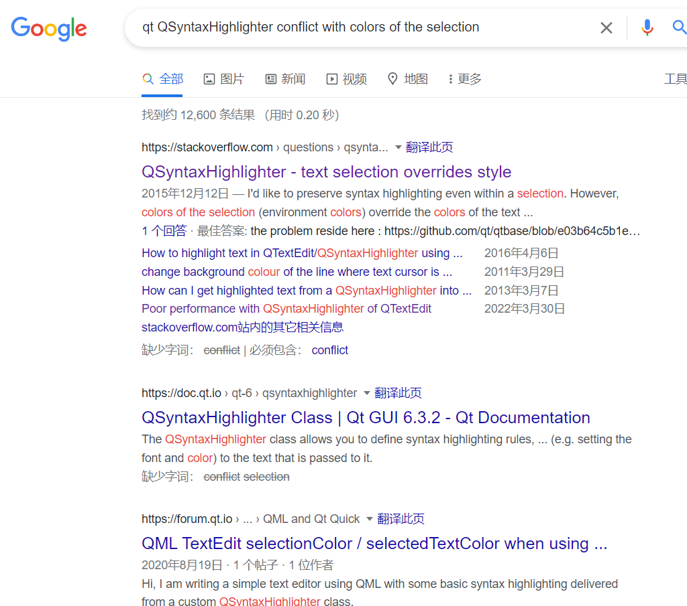

# 前言

这是一份给“小镇做题家”的CS入门指南。

这是我从"小镇做题家"到变成CS专业大学生的经验，也是对我本科三年的一个总结，希望能为那些还未进入CS大门的"做题家"路牌。

目前规划了以下部分：

* 从CS入门到放弃：从高中到大学的转变
* CS中的宝刀：必学工具
* 其他推荐

## 启蒙

大一刚入学时，还是个对编程一窍不通的小白。军训的时候，按着从二手书店买了的《c语言从入门到精通》在自己电脑上折腾上古时代的宝贝：VC 6.0 ，对着谭浩强的c程序设计敲着Hello World，每天和OJ上的字符串操作和数列求值打的难舍难分。本来觉得靠着竞赛和高中数学的底子，在大学可以成为一个不错的大学生，但是这一次的浅尝辄止的自学c语言经历给了我当头一棒。等到开课后，用着老师提供的code::blocks，抄着不知所云的程序，仰望着OI爷们和老师争辩。提到编程，脑子里只有打开一堆英文软件，新建一个文件，运行一个从来没见过的黑窗程序。整个课程都在和OJ斗争，到最后只能把流传以久的学长代码CV上去，最后的程序设计大作业，也是从网上东抄抄西凑凑才搞定的。可以说，半个学期的的程设课，磨灭了我对计算机的任何想法，听着周围同学讨论着链表，DFS那些我从未听过的名词，大作业用着Qt，OpenGL以及MFC这些完全没接触过的技术，甚至有想过转专业。后来开设的计算机系统基础，也给了我的信心沉重的打击，时至今日，对于系统基础第一次课ppt所提出的问题，我还是没有完全搞懂，混着混着一学期就过去了。临近考试，转机似乎来了，抱着临阵磨枪的心态点看了袁春凤老师的慕课，听着听着好像自己对寄存器、堆栈有了点感觉，这也是我第一次体验自学，自此似乎打开了一扇大门。

## 摆脱

有了大一第一学期的经验后，似乎摆在自己面前的路又多了一条：自己动手。彼时，我还处在高考的思想"荼毒"下，脑子里只有分数，坚信着只要理论搞懂，考试考个不错的分数就挺好的。的确，对于高考，这样的想法没什么问题，但是对于大学，这种思想真的会害你还得很惨，缺少实践的学习如同无本之木，尤其对于像计算机这样的工科来说。从数据结构这门课开始，我似乎对这种"高考化"的有了些抗拒，明明理论课上链表、栈、二叉树这些数据结构一看就懂，为什么实验课会举步维艰呢？当我面对着一个高精度求圆周率值敲了一天还没Accept时，我才真正的认识到代码能力的重要。当你肯花一整天把某个数据结构手撸一遍时，当你肯一边一边的调试着原因不明的段错误时，当你愿意把自己的想法用代码实现时，才算真正的步入了CS的大门。很重要的一点，去高考化！高中和大学是不同的两个阶段，也许你可以带着高中的思想完成大学的学业，甚至拿到推免资格，但当你步入社会，谁会看得起一个只能考高分的"卷王"呢？不可否认，当今大学的去高考化做的真的不好，甚至说高考化成为一个风向。大家带着高中时被过度强化的训练和扭曲的价值观(部分)来到大学，而大学提供着陈腐乏味的教程(百年不变的培养方案)和稳固的舒适区(祖传的大作业和往年考题)，更可怕的是。而当你想要实现自己的远大抱负，去改变这个世界时，一个很尖锐的问题：拿什么改变？是考试周前做两套往年题还是大作业照搬学长的代码？我想，如果真的想改变世界，不妨从现在开始先摆脱高考化的思想，做大学高考化潮流下的中流砥柱吧。（借用南大JYY老师的一页ppt）请务必牢记：**大学四年留给你的是你的人生，在你毕业之时，那一串苍白的分数其实就已经作废了。**


## 真正的开始

经历了大一的阵痛和迷茫后，我似乎更能理解这个专业了，大类分流靠着大一不算摆烂的GPA压线进了CS专业。虽然是专业吊车尾，但我似乎对自己的期望不再完全是成绩了，比成绩重要的东西可太多了，我希望自己能真正的把自己学到的东西用起来，或者是希望能学到真正有用的东西。靠着兴趣，暑假自学了python和C++的面向对象，期望着能靠着这些做出一些东西来。巧合的是，开学两周的信息技术实践课实践的就是爬虫，靠着两个月的自学很轻松的完成了项目(甚至还帮几个同学写了大作业)，我才第一次认识到原来靠自学就可以完成"这么大"的项目，也开始摒弃被动接受的思维，转为主动寻找。就这样，抱着玩一玩加上培养下自己的能力的心态，我加入了软件基地和智能车基地，可以说大学里对我影响最大就是加入基地：见识到了很多大佬学长，通过在基地的实践掌握了如何快速学习一个新东西的能力，也真真实实的把自己的能力用到了项目上。从第一次看自己智能车动起来到校赛前折戟，再到被WYL学长选为队友，再到住在基地调PID和陀螺仪滤波，再到去重大参加西部赛。这一路走来，感觉自己真的成长了不少，对自己的去高考化也越来越彻底，暑期报名了ASLP的实习，和队友一起体验了"科研"的感觉，面对曾经望而却步的试点班也可以鼓起勇气去参加... 从某种意义上来说，我的大学是从大二开始的，我一直在告诉自己，就算你把课本上的内容搞得再烂熟，绝不代表你真正对这门课能有什么理解，相反，那些真正理解的人，却不一定能针对考点答出高分，不要为了那些微不足道的分数而放弃自己的未来(这也不是大家摆烂的借口)。

## To Be Continued

"往者不可谏，来者犹可追。"我们当中太多人已经习惯于沿着那一成不变的“典型成功道路”前进，彷佛所有人的终点都是一样，前往终点的道路也只有一条。我们走上了某条道路便只顾着赶路，甚至都没有空停下来看看是否终点不只有一个，道路不仅有一条。我们只看到有人走了捷径，却没有发现正是这些人中间停下了脚步，花了更多的时间来选目标和选路，然后更快地完成罢了。他们的方式更有效率。一位伟人说过：“一个人的命运，既要考虑个人的奋斗，也要考虑历史的进程。”只顾个人奋斗却不顾历史进程也会使你在错误的道路上朝着错误的目标越走越近。在前行的道路上，我们随时都可以停下思考和观察，修正自己的目标或是看看有没有新出现的路。有时候你看不到路，不是因为路不存在，只是你不知道。回首三年大学时光，我一直保有一种强烈的对知识和技术的虔诚。这份虔诚迫使我重新思考每天那本应"司空见惯"的生活；也是这份虔诚让我以我认为正确的方式贯彻自己的追求。在大三升大四的这个暑期，在公司实习的时候，回想自己三年的大学经历，略有不舍，便想着将他记录下来(也是为了工作摸鱼)。一方面，我希望我能为那些像我一样压抑中的灵魂尽一点义务。另一方面，也希望这能成为推动各种不合理制度进步的一种动力。**我们每个人心中总要有些英雄主义**，不是吗？

# 从入门到放弃

## 放弃高考思维

我们的体制总倾向于用一个量化的分数来概括衡量一个人。这一体制在高考中登峰造极。在大学里，我们也会面临无数定量的评分机制：从各科考试、综合测评、到毕业出国、读研、工作. . . 都少不了和分数打交道。面对这些分数，我们必须保持头脑清醒：**如果一个人把政策评分作为自己的至高追求，那么他就是这个政策的牺牲品。** 但是你要知道，分数并不能说明什么，它完全不能说明你对于这门课内容的掌握情况，这是因为信息不对称导致，你所掌握的能力是为了在考试中获得更高的成绩而不是掌握这门课内容本身，相反，许多在这门课上造诣很深的人反而拿不到很高的分数。你需要时刻牢记，你的分数在你毕业之后都已作废，分数的确是通往更高平台的通行证，但是**与你本身的能力却是无关的** 。

## 放弃被动思维

进入大学后，没有人会再为我们自己的行为负责，所以不管做什么都要想清楚自己为什么而作。每天迫于各种压力，毫无主见地忙碌着，可称得上人生一大悲哀。但是很多时候我们并不能，我们无法回答出自己为什么每天都要去上课，如果去上课仅仅是为了回答老师的点名的话，正如我之前所说，分数的意义在毕业后就不复存在，那么，如果存在一些可以不去上课而获得一个相对满意的分数，如果不去上课可以做一些更有意义的事情，如果我们所感兴趣的知识并没有课程能够涉猎，这时候我们还需要去上课吗？**正确的浪费剩余的时间！**

## 放弃"连续"的思维

扯了这长篇幅废话，终于要来点"学术"上的东西了。 思考一个问题，已知$a_n=2a_{n-1}, a_0 = 1,求a5的值$，很简单吧，看一眼就能得出答案，但如果假设你是一个计算机，你该怎样计算呢？计算机可没办法一眼看出通项公式是$a_n = 2^n$，他能做的就是一次次迭代(不考虑优化)：

```
a_pre,a_next = 1,0
for i=0:5
   a_next = a_pre*2
   a_pre = a_next

```

计算机并不是连续的，而我们高中时的思维是连续，这也是很多人最开始程设觉得难的原因。往深的说，程序乃至整个计算机系统都是一个[状态机模型](https://zhuanlan.zhihu.com/p/47434856)，对于程序设计语言来说，变量(对象)的值是状态，而当中的控制流就是描述状态如何转移，对于计算机系统来说，状态便是寄存器和内存，汇编指令则是在描述状态的转移。值得一提的是，在某种程度上，这两个状态机是等价的，甚至存在转换工具(编译器)。如果从开始接触CS是就有了状态机的概念，并在以后的学习不断强化理解他，这样你就嫩很快理解CS这门学科(大部分的东西都与状态机有关)。

# 必学工具

## 写在前面的话

### 远离CSDN和百度

如果你不想在一堆相互抄来抄去的文章和广告里寻找自己想要的东西，就去试试bing和Google。一个很形象的比喻，在CSDN和百度上找东西就像是在垃圾堆里面找宝贝。已我最近工作时查找的问题为例：




百度的给我提供的东西只能说是毫无关系，而谷歌第一个就是相关的问题，如果你打开第一个StackOverflow的链接，你可以发现回答者从Qt源码级指出了问题并提供了解决方案。也许一次这样的差距并不能决定什么，也许百度/CSDN会给你提供一个不知道为什么的解决方案... 但长久下去，别人每次都能从搜素中获取知识，而你每次只能复制一堆不知道是啥的命令去执行暂时的解决问题，差距不就有了吗？

### 避免中文关键词

### RTFM，STFW，RTFSC

### 如何面对问题

### The Missing Semester

我强烈推荐抽一些时间, 学习一下 MIT 的 [The Missing Semester of Your CS Education](https://missing.csail.mit.edu/)，这会对后来的学习有很大帮助。

## 翻墙

由于一些众所周知的原因，谷歌、GitHub 等网站在大陆无法访问。然而很多时候，谷歌和 StackOverflow 可以解决你在开发过程中遇到的 95% 的问题。因此，学会翻墙几乎是一个内地 CSer 的必备技能。因为这个话题比较敏感，有需求的话可以考虑某些开源项目

* [https://github.cm/freefq/free](https://github.com/freefq/free)
* [https://github.com/bannedbook/fanqiang](https://github.com/bannedbook/fanqiang)
* [https://github.com/Alvin9999/new-pac](https://github.com/Alvin9999/new-pac)

PS：打个小广告

个人自用的VPN

## Git

## Linux

## 程序设计语言

## GDB/LLDB

## Docker

## 生存指南

# 其他推荐
